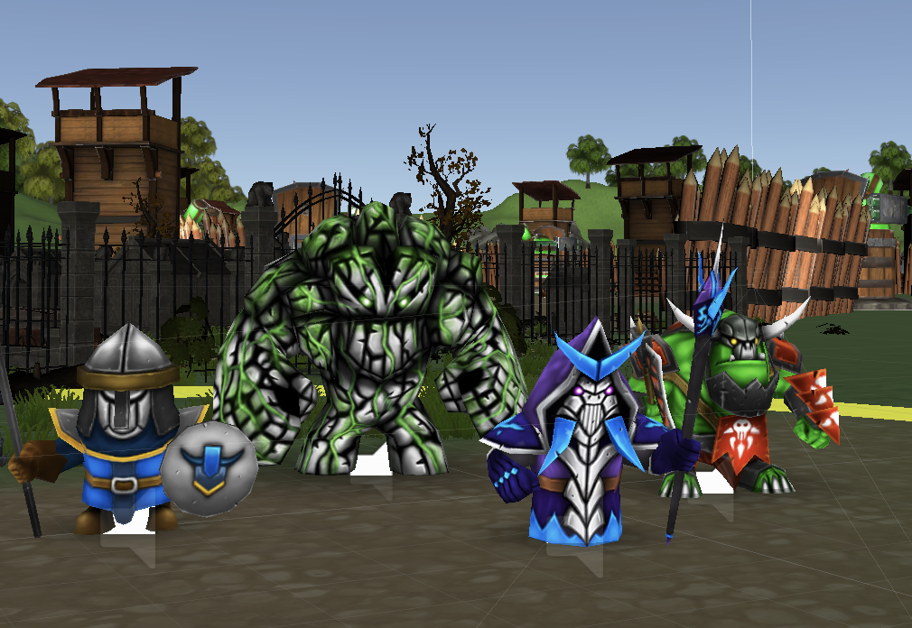

# Quad Battle - Unity Game

##### Epicodus Group Project C# 10/04/2018.
_by Ryan Lee, Brian Nelson, Skye Nguyen_

## Description

Quad Battle is a single player, turn base movement and combat game that uses the Unity Game Engine. This game was made to demonstrate our understanding of Unity and our abilities implementing C# code within the Unity framework. Important features of this game are: 
 1) Turn base movement for player and AI that using Camera Ray casting.
 2) Spawn points that generate a random number of enemies.

## How to Play - Controls

- Camera Controls:
  * WASD to pan the camera.
  * Q and E to rotate the camera.
  * Press HOME to snap the camera to the currently selected player character.
- To Move: right click within the character's ring
- To Attack: right click on an enemy that has a target above its head.
- To Change Character - press tab
- To End Turn - press space.

The player is spawned into a premade level at a predetermined spawn point. From there, the player can control four characters: The Footman, The Lich, The Orc, The Golem. The player can first move The FootMan, followed by the The Lich, then The Orc, and lastely The Golem.

Each character can move or attack using Action Points. Each character is given two Action Points at the start of their turn. Moving or attacking costs one Action Point. Where a character can move is represented by a ring around the character. The character can click within that ring and move to that location. The character can attack an enemy if that enemy is within their ring with expection to The Lich who can attack enemies outside his ring using a ranged attack. Additionally, a target will appear above an enemy's head if they are attackable by the character. 

Kill the Bull King to win the game.

## Credits

**The following assets were used in making of this demo game:**

**The Playable Characters**

* "Mini Legion Footman Handpainted"
* "Mini Legion Lich Handpainted"
* "Mini Legion Grunt Handpainted"
* "Mini Legion Rock Golem Handpainted"

All Playable Characters created by [Dungeon Mason](https://assetstore.unity.com/publishers/23554)

**The Enemies**

["Fantasy Monster - Skeleton" by Teamjoker](https://assetstore.unity.com/publishers/12724)

["BOSS Class - Bull" by Dr.Game](https://assetstore.unity.com/publishers/11890)

["Rock Warrior" by Rain Entertainment](https://assetstore.unity.com/publishers/37390)

["Toon Rock" by MeshSmith](https://assetstore.unity.com/publishers/38396)

**Terrain**

["Fantasy Landscape" by Pxltiger](https://assetstore.unity.com/publishers/11247)
["Medieval Defense, Low-Poly, All maps" by Hit Jones](https://assetstore.unity.com/publishers/8294)
["Make Your Fantasy Game - Lite" by xiaolianhuastudio](https://assetstore.unity.com/publishers/2752)

**Audio**

["Universal Sound FX" by Imphenzia](https://assetstore.unity.com/publishers/479)

## Setup/Installation Requirements

1. Download the zip from https://github.com/sn31/UnityGame.

2. Inside the root folder, open up the folder 'Builds'.

3. Run 'QuadBattle.exe'.

## Support and contact details

Please contact us at nelsonsbrian@gmail.com, hyungnaelee@gmail.com or skye@dames.es for more information and/or feedback.

## Technologies Used

* C#/.Net Core 1.1
* Unity

### License: MIT.

#### Copyright (c) 2018.
